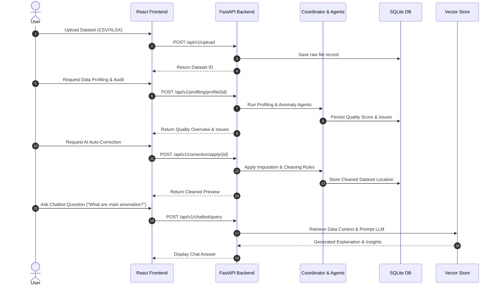

# Data Quality Processing Workflow

```mermaid
sequenceDiagram
    autonumber
    actor User
    participant UI as React Frontend
    participant API as FastAPI Backend
    participant Agent as Coordinator & Agents
    participant DB as SQLite DB
    participant RAG as Vector Store

    User->>UI: Upload Dataset (CSV/XLSX)
    UI->>API: POST /api/v1/upload
    API->>DB: Save raw file record
    API-->>UI: Return Dataset ID

    User->>UI: Request Data Profiling & Audit
    UI->>API: POST /api/v1/profiling/profile/{id}
    API->>Agent: Run Profiling & Anomaly Agents
    Agent->>DB: Persist Quality Score & Issues
    API-->>UI: Return Quality Overview & Issues

    User->>UI: Request AI Auto-Correction
    UI->>API: POST /api/v1/correction/apply/{id}
    API->>Agent: Apply Imputation & Cleaning Rules
    Agent->>DB: Store Cleaned Dataset Location
    API-->>UI: Return Cleaned Preview

    User->>UI: Ask Chatbot Question ("What are main anomalies?")
    UI->>API: POST /api/v1/chatbot/query
    API->>RAG: Retrieve Data Context & Prompt LLM
    RAG-->>API: Generated Explanation & Insights
    API-->>UI: Display Chat Answer
```
